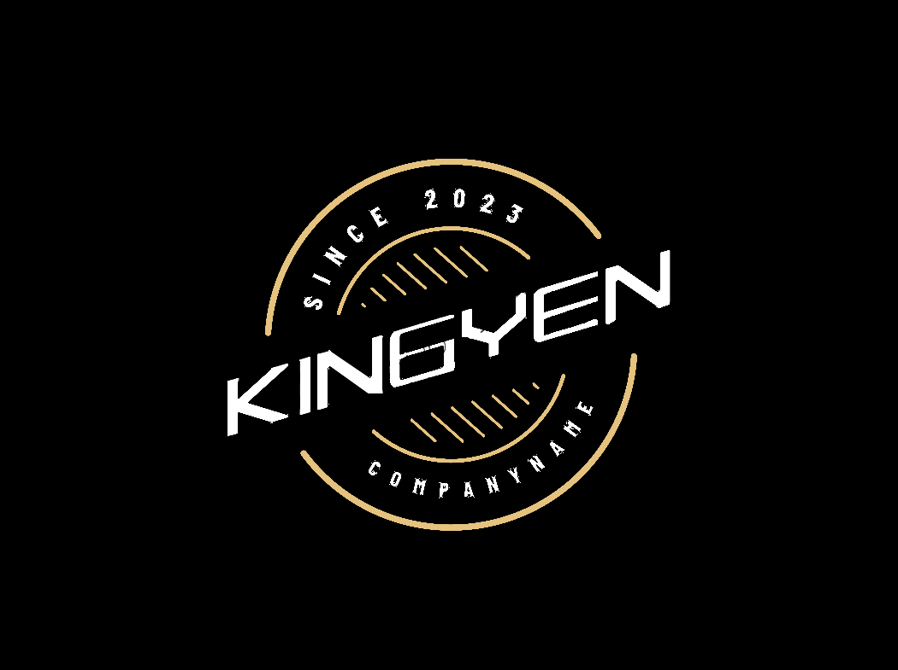

  
  

### 
I'm King Yen, future full-time full-stack freelance developer 👨‍💻 , and studying programming at university since 2022 🚀
  

  
  

  

### About me  
- 🎓 I'm currently studying CS at QIT.  
  

- 🌱 I’m currently learning Golang, Swift and React.  
  

- ❓ A interested in C++, Go, NodeJS, Vue, and React development, and maintains a thirst for C++, Rust, Swift, and Mojo🔥!  
  

- ⚡ Just a wee bit of light from the Computer Software Studio and Algorithms Studio at QIT's School of Computer and Information Engineering, and he's doing his best to get better.  
  

   

## Github Stats  

  
  
  

  

 

## My Skill Set  

<table><tr><td valign="top" width="33%">

### Frontend  

  
  
  
   
  
  
 
  
  
 
  
  
 
  
  

</td><td valign="top" width="33%">

### iOS Client  

  
  

  

### Backend  

 
  
  
  
  
 
 
  
  
  

</td><td valign="top" width="33%">

### Other  

  
  
  
 
  
  
 
  
  
  

</td></tr></table> 

   

## Connect with me  

  

 

 

----
